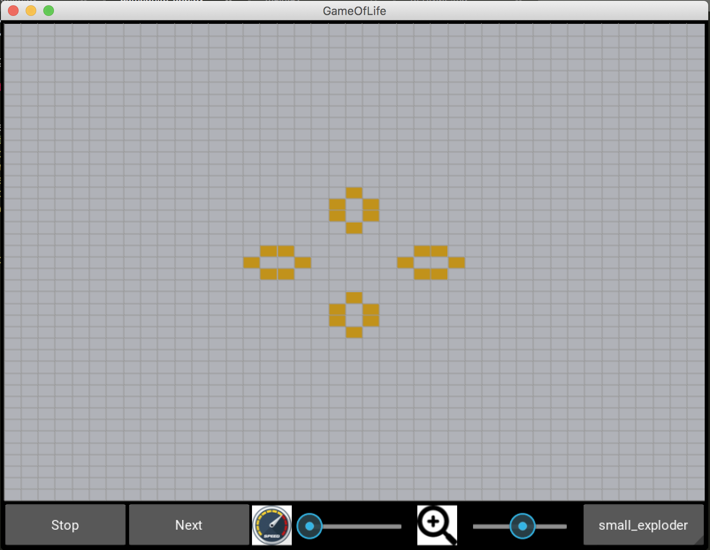

# Game of Life

This is an implementation of **James Conway's Game of Life**. This game consists in following the evolution of a group of cells, which are multiplying, surviving or dying depending on a set of simple mathematical rules. Depending on the initial position of the cells, different patterns can be reached during the game.

The game is implemented here as a Kivy Application.

## Rules of the Game of Life

For a space that is *populated*:
- Each cell with one or no neighbors dies, as if by solitude.
- Each cell with four or more neighbors dies, as if by overpopulation.
- Each cell with two or three neighbors survives.

For a space that is *empty*:
- Each cell with three neighbors becomes populated.

## Controls

- You can first select one of the predefined patterns in the drop-down menu or you can draw youself the initial shape by clicking on the screen. You can also click during the animation to add or remove points.
- The speed and zoom are controlled by two dedicated dials.

## How to run the Kivy Application on your computer

**Requirements**: You'll need Python 2, with Kivy installed. The steps to install Kivy, depending on your OS are [here](https://kivy.org/docs/installation/installation.html).

**Run the app**: You'll just have to execute the gameoflife-app.py file. In bash, go to the folder containing the application and type `python gameoflife-app.py`.

Here is a screenshot of the application: 

